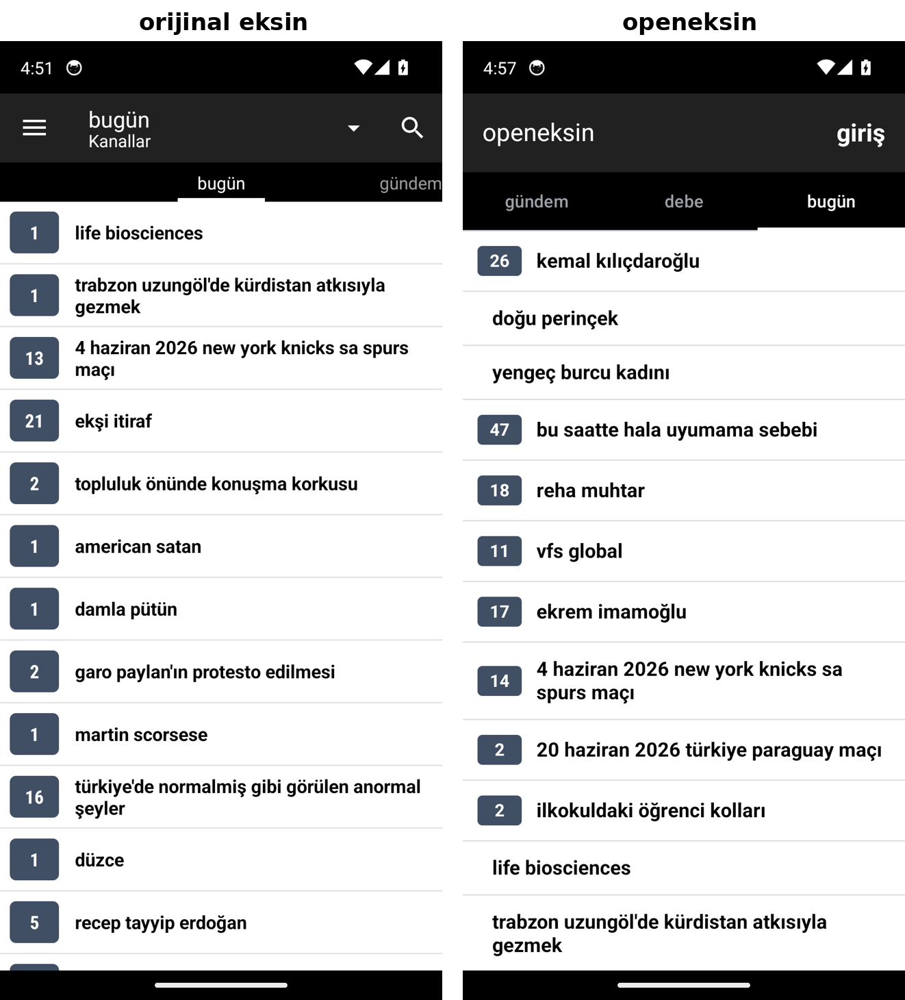

# openeksin

An open-source, clean-room Android client for [Ekşi Sözlük](https://eksisozluk.com),
built from scratch with **Kotlin + Jetpack Compose**.

It is inspired by the closed-source "Ekşin" app, but shares **no code or assets**
with it. The goal is a maintained, ad-free, tracker-free reader/writer that other
people can use and contribute to.

> **Status: working reader.** Browses the live `gündem`, `debe` and `bugün`
> feeds, opens topics as native entry lists, and supports WebView login — all
> with Cloudflare handling and the original app's visual design. Many features
> are still to come — see the roadmap.

Original (left) vs openeksin (right):



## Why

The original app's developer is unresponsive and bugs (e.g. the Cloudflare login
breakage) go unfixed. openeksin is a community-maintainable alternative with a
modern, testable codebase.

## What works today

- **Swipeable channel tabs**: `gündem`, `debe`, `bugün`, `tarihte bugün` plus the
  full dynamic channel list scraped from `/kanallar` (`#spor`, `#siyaset`, …).
  Tabs are a `ScrollableTabRow` synced to a `HorizontalPager`, so you can swipe
  left/right between feeds — no login required.
- **Navigation drawer**: hamburger menu matching the original — `genel`
  (başlıklar / ara / arşiv / ayarlar) and `yazar` (giriş, or the logged-in nick +
  `mesajlar` / `olaylar` / çıkış). All entries are functional native screens.
- **Search (native)**: `ara` (drawer + top-bar icon) with live title
  autocomplete (`/autocomplete/query`); picking a suggestion opens the topic
  in-app.
- **Settings (native)**: `ayarlar` lets you pick the theme (system / light /
  dark); applied instantly and persisted.
- **Archive (native, local)**: `kaydet` on an entry stores it locally; `arşiv`
  lists the saved entries (topic title, body, author/date) with delete.
- **Messages (native)**: `mesajlar` opens a native inbox (correspondent, unread
  count badge, preview, date) and tapping a row shows the conversation as native
  chat bubbles. A reply box at the bottom sends messages (scrapes the
  anti-forgery token from the thread, posts to `/mesaj/yolla`) — verified
  on-device. The thread top bar has a **konuşmayı sil** action (eksi only
  supports whole-conversation delete via `/mesaj/processthread`, not
  single-message delete); the inbox refreshes after a delete.
- **Olaylar (native)**: opens `/basliklar/olay` as a native topic feed.
- **Native entry screen**: tapping a topic opens its entries in-app with the
  original layout — per-entry favorite count, "devamını okuyayım… (N satır)"
  collapse for long entries, a separator, bold author nick + date, inline
  `(bkz: …)` links, and page navigation (`1 / N`). No external browser.
- **Entry actions**: the 3-dot sheet matches the original. Logged out: paylaş /
  tarayıcıda aç. Logged in: **favori** (favla/favlama), **artı/eksi oy** (vote),
  **takip et / engelle / başlıklarını engelle** (userrelation toggle, with
  correct ↔ labels), **mesaj yolla** (compose to author), **paylaş** and
  **kaydet** (local archive). Favorite, vote, follow/unfollow and reply are
  verified end-to-end on-device.
- **Login**: WebView sign-in (`LoginActivity`) at `/giris`; cookies are shared
  with okhttp, the nick is detected from the home page, and the session is
  restored on next launch. Logout clears cookies.
- **Networking core**: shared okhttp client with a modern Chrome User-Agent and a
  cookie bridge to the WebView (so a Cloudflare `cf_clearance` cookie is reused).
  List feeds are fetched as AJAX partials (`X-Requested-With: XMLHttpRequest`);
  full pages (login/nick detection, entries) are fetched normally.
- **Cloudflare handling**: requests that hit a challenge raise `CloudflareException`;
  the UI can open a WebView (`CloudflareActivity`) to clear it, then retry.
- **Design system**: top bar, tab strip, rank badges, colors and text sizes
  replicated from the original (functional values) for a familiar look. Light + dark.
- **Two build flavors**: `play` (`com.drejo.openeksin`) and `fdroid`
  (`com.drejo.openeksin.fdroid`) so both can coexist on one device.

> Note: Cloudflare's Turnstile (the "verify you are human" widget on the login
> page) blocks automated browsers, so **login must be done on a real device**.

## Architecture

```
ui/            Compose UI + in-app navigation (MainActivity back-stack)
ui/topic/      Topic list + per-feed pager page (FeedPage, StandaloneFeedScreen)
ui/entry/      Native entry-list screen (topic detail) + action sheet
ui/message/    Native message inbox + thread with reply box
ui/misc/       Search, Settings, Archive screens
ui/theme/      OpeneksinTheme: Color tokens, Typography, dark/light schemes
data/          EksiRepository, TopicFeed, SessionManager
data/local/    Persisted stores: SettingsStore (theme), SavedStore (archive),
               RelationStore (follow/block cache)
data/remote/   EksiClient (okhttp), Endpoints, WebViewCookieJar,
               CloudflareActivity, LoginActivity
data/scraper/  Jsoup parsers (TopicIndexScraper, EntryScraper, MessageScraper,
               ChannelScraper, LoginScraper)
data/model/    Plain data models (Topic, Entry, TopicDetail, Message, …)
```

Data comes from scraping eksisozluk.com's public HTML (it has no public API), the
same approach FOSS apps like NewPipe use for other sites.

## Building

Builds run **inside Docker** so no Android SDK is installed on the host.

```bash
# 1. Build the Android build-environment image (once)
./scripts/dockerbuild.sh

# 2. Compile debug APKs for both flavors (output under app/build/outputs/apk/)
./scripts/indockerbuild.sh
#    or a single flavor:
./scripts/indockerbuild.sh :app:assemblePlayDebug
```

Install on a connected device:

```bash
adb install app/build/outputs/apk/play/debug/app-play-debug.apk
```

Debug builds are signed with a stable, checked-in debug key
(`keystore/debug.keystore`), so reinstalling an update keeps the same signature
and preserves the logged-in session (no uninstall needed).

Tech stack: Kotlin 1.9, AGP 8.5, Jetpack Compose (BOM 2024.06), okhttp 4, Jsoup,
Coroutines. minSdk 21, targetSdk 34.

## Roadmap

- [x] Topic → native entry list screen
- [x] Login (WebView) + session
- [x] `bugün` feed
- [x] Entry paging + favorites count
- [x] Search + autocomplete
- [x] Vote, favorite, follow/block
- [x] Messages (native inbox + thread + reply)
- [x] Archive (local saved entries) + settings (theme)
- [x] Write/edit/delete entries, drafts
- [x] Topic menu: başlıkta ara, şükela sort
- [ ] New-message compose to non-correspondents, "kimdir" profiles
- [ ] Notifications, widgets
- [ ] F-Droid flavor: strictly FOSS (no ads/analytics), publish metadata

## Contributing

Issues and PRs welcome. Keep the `fdroid` flavor free of proprietary
dependencies (no ads, no Google/Firebase) so it stays F-Droid-eligible.

## Legal

- This is an **independent** project, not affiliated with or endorsed by Ekşi
  Sözlük or the original Ekşin app.
- It contains **no** code or assets from the original app. The launcher icon and
  branding are original; only functional design values (color hex codes, text
  sizes) are matched.
- "Ekşi Sözlük" and related marks belong to their respective owners. Use this
  client in accordance with the website's terms and your local laws.

## License

[GNU GPLv3](LICENSE).
