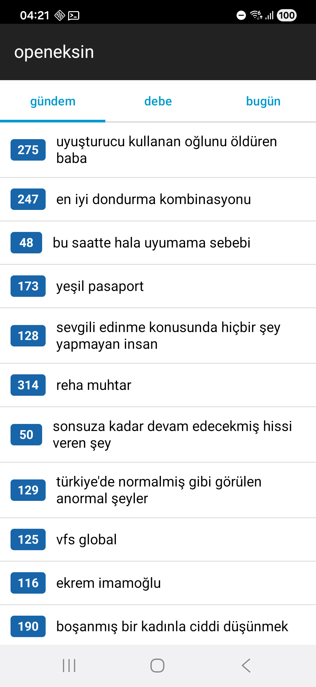

# openeksin

An open-source, clean-room Android client for [Ekşi Sözlük](https://eksisozluk.com),
built from scratch with **Kotlin + Jetpack Compose**.

It is inspired by the closed-source "Ekşin" app, but shares **no code or assets**
with it. The goal is a maintained, ad-free, tracker-free reader/writer that other
people can use and contribute to.

> **Status: early MVP.** The foundation works end-to-end: it fetches and renders
> the live topic lists from eksisozluk.com, with Cloudflare handling and the
> original app's visual design (colors, type scale). Many features are still to
> come — see the roadmap.



## Why

The original app's developer is unresponsive and bugs (e.g. the Cloudflare login
breakage) go unfixed. openeksin is a community-maintainable alternative with a
modern, testable codebase.

## What works today

- **Topic lists**: `gündem` (popular) and `debe` (yesterday's best) load live.
- **Networking core**: shared okhttp client with a modern Chrome User-Agent and a
  cookie bridge to the WebView (so a Cloudflare `cf_clearance` cookie is reused).
- **Cloudflare handling**: requests that hit a challenge raise `CloudflareException`;
  the UI can open a WebView (`CloudflareActivity`) to clear it, then retry.
- **Design system**: colors and text sizes replicated from the original
  (functional values) for a familiar look. Light + dark.
- **Two build flavors**: `play` (`com.drejo.openeksin`) and `fdroid`
  (`com.drejo.openeksin.fdroid`) so both can coexist on one device.

`bugün` requires a logged-in session and will light up once auth lands.

## Architecture

```
ui/            Compose UI (MainActivity, tabs, TopicListScreen, ViewModel)
ui/theme/      OpeneksinTheme: Color tokens, Typography, dark/light schemes
data/          EksiRepository, TopicFeed
data/remote/   EksiClient (okhttp), Endpoints, WebViewCookieJar, CloudflareActivity
data/scraper/  Jsoup-based parsers (TopicIndexScraper)
data/model/    Plain data models (Topic, ...)
```

Data comes from scraping eksisozluk.com's public HTML (it has no public API), the
same approach FOSS apps like NewPipe use for other sites. The topic lists are
fetched as AJAX partials (`X-Requested-With: XMLHttpRequest`).

## Building

Builds run **inside Docker** so no Android SDK is installed on the host.

```bash
# 1. Build the Android build-environment image (once)
./scripts/dockerbuild.sh

# 2. Compile debug APKs for both flavors (output under app/build/outputs/apk/)
./scripts/indockerbuild.sh
#    or a single flavor:
./scripts/indockerbuild.sh :app:assemblePlayDebug
```

Install on a connected device:

```bash
adb install app/build/outputs/apk/play/debug/app-play-debug.apk
```

Tech stack: Kotlin 1.9, AGP 8.5, Jetpack Compose (BOM 2024.06), okhttp 4, Jsoup,
Coroutines. minSdk 21, targetSdk 34.

## Roadmap

- [ ] Topic → entry list screen (read entries, paging, "şükela")
- [ ] Login (WebView) + session, then `bugün`
- [ ] Search, autocomplete
- [ ] Vote, favorite, follow
- [ ] Write/edit/delete entries, drafts
- [ ] Messages, "kimdir", buddy/block relations
- [ ] Archive, notifications, widgets
- [ ] F-Droid flavor: strictly FOSS (no ads/analytics), publish metadata

## Contributing

Issues and PRs welcome. Keep the `fdroid` flavor free of proprietary
dependencies (no ads, no Google/Firebase) so it stays F-Droid-eligible.

## Legal

- This is an **independent** project, not affiliated with or endorsed by Ekşi
  Sözlük or the original Ekşin app.
- It contains **no** code or assets from the original app. The launcher icon and
  branding are original; only functional design values (color hex codes, text
  sizes) are matched.
- "Ekşi Sözlük" and related marks belong to their respective owners. Use this
  client in accordance with the website's terms and your local laws.

## License

[GNU GPLv3](LICENSE).
